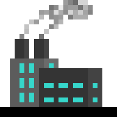

# gogen (golang code generator)

Gogen is a simple code generator. It allows you to write generic code in golang or turn any existing code into template with no more then 3 short lines of comments. You don't have to apply any special syntax to your code that would be disliked by compiler. Nested definitions are supported, so we can say that you can generate almost anything, however complex it may be.

# Installation

I assume you have golang already installed, you don't need anything other then that. Just use `go get github.com/jakubDoka/gogen`, then use `go build gogen.go` and finally add file with executable to your `path` environment variable. This way you can use `gogen` command from anywhere you desire.   

# Tutorial

Nothing can be done without annotations as parsing all your code, as possible template would be inefficient. Gogen uses annotation blocks witch restrict what gogen should care about or what to ignore. Blocks then can have further annotations. Always close your blocks or they will get ignored. Lets start with a core piece, def-block.

```go
//def(
//rules Max<int>
func Max(a, b int) int {
	if a > b {
		return a
	}
	return b
}
//)
```

Def block has a rules annotation, rules define how your template work. In this case int is a template argument that will get replaced when generating code. Naming a function same as template is necessary so gogen knows what to replace with unique identifier. Thats because go does not have polymorphism, you have to name function your self. Next is gen-block:

```go
/*gen(
	Max<float64, MaxF64>
	Max<float32, MaxF32>
	Max<byte, MaxB>
)*/
```
You may noticed that there is one extra argument and that is the unique identifier you have to provide. After running `gogen <package import>` (gogen project/max) gogen creates new file named gogen-output.go with following content:

```go
package max

func MaxF64(a, b float64) float64 {
if a > b {
return a
}
return b
}

func MaxF32(a, b float32) float32 {
if a > b {
return a
}
return b
}

func MaxB(a, b byte) byte {
if a > b {
return a
}
return b
}
```

This is how you can generate your templates, you have to tell what you need, but its already better then defining them all by hand, now you can make a change to original and just rerun generation. There is also no indentation, i admit I em to lazy to support that as its not necessary for code to compile. Cross package generation is also supported. We have imp-block for this reason:

```go
/*imp(
	templates/max
)*/
```

You can then refer to the templates from package as `(package name).(template name)<...template arguments>` (max.Max<float64, MaxF64>). in case you want to use external types in your templates you have to inform gogen about it:

```go
/*gen(
	!libs/my_types
	max.Max<my_types.Float64, MaxF64>
	max.Max<my_types.Float32, MaxF32>
)*/
```

Last type of block is ign-block that its for ignoring pieces of code. Gogen takes notes about all items in your package, so it can annotate all items with `(package name).` in case of external generation. You may be shadowing something and so if you are not willing to rename shadows you can wrap shadowed code in ign-block. In case you have some huge file in your package and you do not want gogen to bother with that you can put opened ign-block on a beginning of a file.

## Regenerating

If you change your template, wether you fix bug or add new feature, you can use `gogen <changed package name> r` to regenerate all packages that depend on this package. Gogen maintains this dependency in json file with path `%GOPATH%/gogen-data/connections.json`, so no search for dependent packages is needed.

## Advanced Generation

You can make nested gen requests if you really need. Nesting depth isn't limitless, you can get stackOverflow if you try really hard. So basically you can generate 2D Slice from template like this.

```go
/*gen(
	templates.Vec<templates.Vec<int>, IntVec2D> 
)*/
```

Notice that we don't specify name for inner requests, gogen will generate own identifier or reuse already generated template if it exists.

Its little bit tedious but yo can combine your templates together with `dep` annotation, but firs we will define one small template:

```go
//def(
//rules Min<int>
func Min(a, b int) int {
	if a < b {
		return a
	}
	return b
}
//)
```

Okay and now we will combine min and max and create clamp function:

```go
//def(
//rules Clamp<int>
//dep Max<int, Max>
//dep Min<int, Min>

func Clamp(val, min, max int) int {
	return Max(min, Min(max, val))
}

//)
```

Notice that template in dep annotation has to exist and you are actually using is as request, same as in gen block. Lets generate our function like usual:

```go
/*gen(
	Clamp<float64, ClampF64>
)*/
```

gogen-output.go now looks like this

```go
package max

func ClampF64(val, min, max float64) float64 {
return Max(min, Min(max, val))
}


func Max(a, b float64) float64 {
if a > b {
return b
}
return a
}


func Min(a, b float64) float64 {
if a < b {
return a
}
return b
}
```

# todo

This is a section with listed features that should be implemented, contributors are welcomed
* make block syntax configurable
* make output file name configurable


